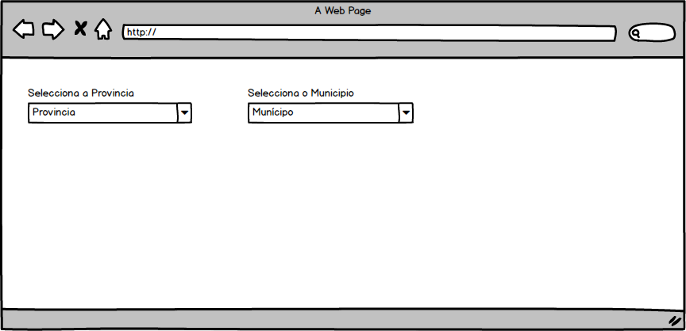

 Este projecto foi utilizando o comando create-react-app

Este projecto permite que ao seleccionar uma provincia faz um filtro de todos os municipios da provincia seleccionada:

<ul>
    <li> <h2> Passo para configuração e instalação do projecto no seu computador</h2> </li>
  <li> 
    Primeiro Passo:
	
 Baixar o Projecto

  </li>
  <li> 
    Segundo Passo: 
	
 Exexutar o seguinte comando npm install para instalar as dependencias do projecto

  </li>
  <li> 
     Terceiro Passo:
	
 Exexutar o seguinte comando npm start para inicial o projecto

  </li>
    
</ul>
